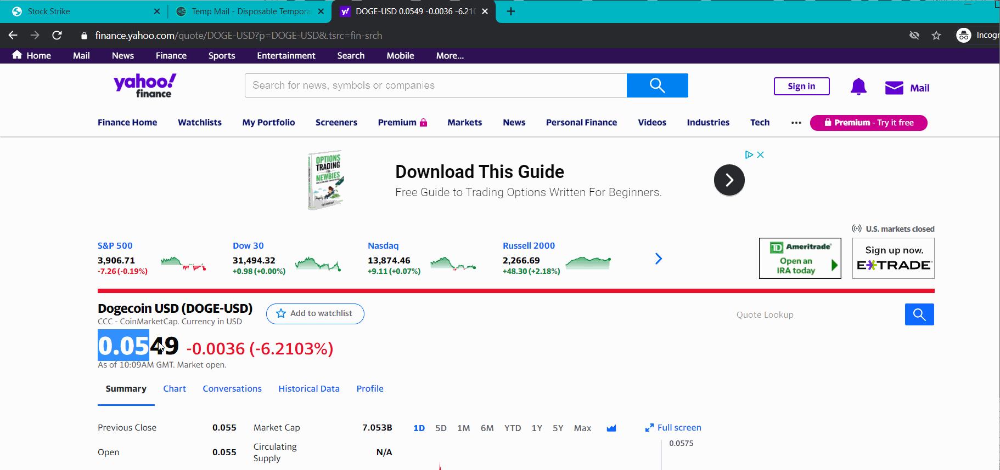

# Stock-Strike
Hack-and-wellness Hackathon project made with Flask, Beautiful Soup, and SMTP Python modules.

## Walkthrough

## Functionality
The website takes in the ticker symbol of the stock you want to track, the price target you have for the stock, and your email. If the price of the stock reaches the price target, you will receive an email confirming that your price target has been met.

## References
See [DevPost](https://devpost.com/software/stock-strike) submission

## Licenses
Copyright 2021 Mohammad Rahman

   Licensed under the Apache License, Version 2.0 (the "License");
   you may not use this file except in compliance with the License.
   You may obtain a copy of the License at

       http://www.apache.org/licenses/LICENSE-2.0

   Unless required by applicable law or agreed to in writing, software
   distributed under the License is distributed on an "AS IS" BASIS,
   WITHOUT WARRANTIES OR CONDITIONS OF ANY KIND, either express or implied.
   See the License for the specific language governing permissions and
   limitations under the License.
